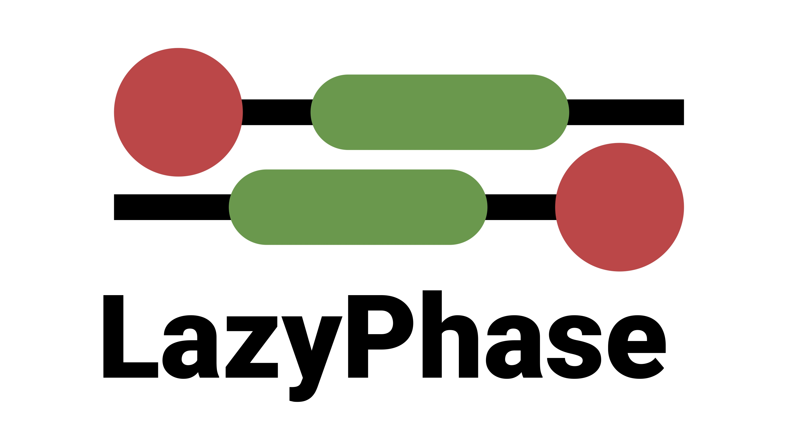

LazyPhase
====================



### Introduction

LazyPhase is a Moltemplate- and LAMMPS-based tool for high-throughput
simulations of phase behavior of polypeptide-like polymers. A user can specify
the alphabet of side chains, their sizes and interactions.

The tool is focused on comparison of sequence effects on phase and condensate behavior, including various distributions of residues in polypeptides with
identical compositions.

### Dependencies

[Python](https://www.python.org)\
[Moltemplate](https://github.com/jewettaij/moltemplate)\
[LAMMPS](https://docs.lammps.org)\
*Optional: [Kokkos](https://kokkos.org/kokkos-core-wiki/index.html) or other GPU interface*

### Guide

For help:
```
lazyphase --help
```

Generating the sequences and preparing the high-throughput simulations:
```
lazyphase generate_sequences --dir examples/stickers_spacers --num 100 --composition S48.L16
```

Prepare the simulations, the same conditions will be applied to each sequence,
because the tool is designed to investigate sequence effects:
```
lazyphase prepare --dir examples/stickers_spacers
```
Here we runned with the default parameters, they all can be specified according
to the CLI help message.

Run the high-throughput simulations:
```
lazyphase run --dir examples/stickers_spacers --lmp lmp_kokkos
```
--seqs specifies the file containing the sequences, each in separate line, and
--time is the modeling time in microseconds.

Rewarding Your simulation efforts, the simulations can be automatically analysed
:
```
lazyphase analyse --dir examples/stickers_spacers
```

### Copyright, contact, and citation

If You have any issues, questions, suggestions, write to
vasilenko_eo@sysbiomed.ru without doubts.

(C) Egor Vasilenko, Ivankov Lab.

If use, please cite:
